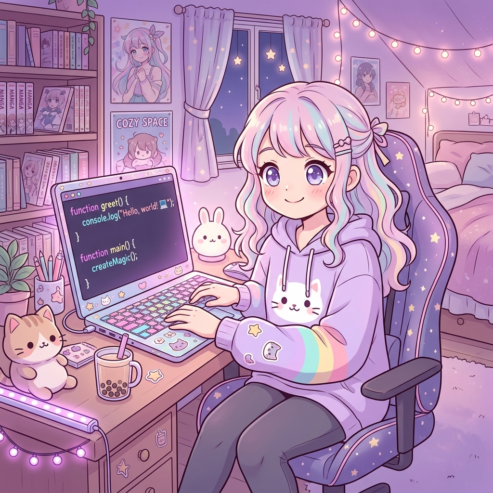

<div align="center">

<!-- Animated Header -->


<!-- Typing Animation -->
<a href="https://git.io/typing-svg"></a>

<br/>

<!-- Social Badges -->
[](https://github.com/s-yasmin02)
[](https://github.com/s-yasmin02)
[](https://github.com/s-yasmin02)

</div>


## 🌸 About Me

```yaml
name: Swetha Kalutotage
role: IT Student
location: 🌏
currently_learning: [ "Mobile Development", "Test Automation", "Full-Stack Web Dev" ]
interests: [ "Android/Kotlin", "Web Applications", "QA & Testing" ]
fun_fact: "I believe every bug is just a feature in disguise 🐛✨"
```




<br clear="both"/>


## 🛠️ Tech Stack & Skills

<div align="center">

### 💻 Languages
<p>


</p>

### 🧩 Frameworks & Libraries
<p>


</p>

### 🔧 Tools & Platforms
<p>


</p>

### 🧪 Testing
<p>


</p>

</div>


## 🚀 Featured Projects

<div align="center">

<a href="https://github.com/s-yasmin02/NekoHabits">
  
</a>
<a href="https://github.com/s-yasmin02/student-event-management-system">
  
</a>
<a href="https://github.com/s-yasmin02/Assignment1-ITPM">
  
</a>
<a href="https://github.com/s-yasmin02/playwright-translator-assignment">
  
</a>

</div>


## 📊 GitHub Stats & Contributions

<div align="center">


<br/>


<br/><br/>

<!-- Contribution Graph -->


</div>


## 🏆 GitHub Trophies

<div align="center">

</div>


## 🐍 Watch My Contributions Get Eaten

<div align="center">
<picture>
  <source media="(prefers-color-scheme: dark)" srcset="https://raw.githubusercontent.com/s-yasmin02/s-yasmin02/output/github-contribution-grid-snake-dark.svg" />
  <source media="(prefers-color-scheme: light)" srcset="https://raw.githubusercontent.com/s-yasmin02/s-yasmin02/output/github-contribution-grid-snake.svg" />
  
</picture>
</div>

> 💡 *Set up the [Snake Animation GitHub Action](https://github.com/Platane/snk) to auto-generate the contribution snake!*


## 🎯 Current Goals for 2026

<div align="center">

| 🎯 Goal | 📌 Status |
|:---|:---:|
| 🐱 Complete & publish **NekoHabits** Android app | 🔄 In Progress |
| 🌐 Build a full-stack portfolio website | 📋 Planned |
| 🤝 Make my first **open source contribution** | 📋 Planned |
| 🧪 Master **Playwright & Selenium** test frameworks | 🔄 In Progress |
| 📱 Learn **Jetpack Compose** advanced patterns | 🔄 In Progress |
| 💼 Land an **internship** in software development | 🎯 Goal |

</div>


## 📫 Let's Connect!

<div align="center">
<p>

[](mailto:swethayasmin02@gmail.com)
[](https://github.com/s-yasmin02)

</p>

<br/>

### 💜 Thank you for visiting my profile! 


<br/>

*✨ "Code is like humor. When you have to explain it, it's bad." — Cory House*

</div>

<!-- Animated Footer -->

